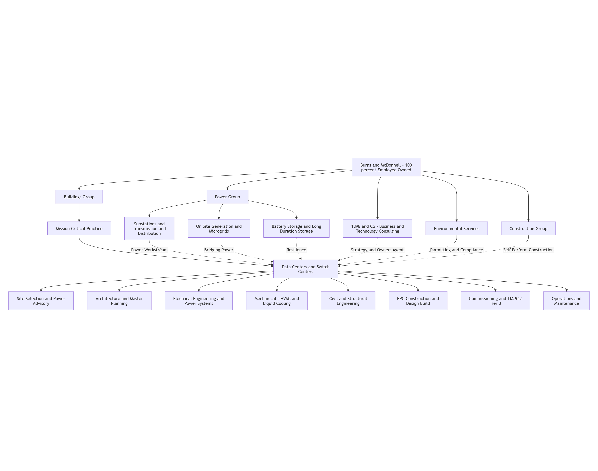
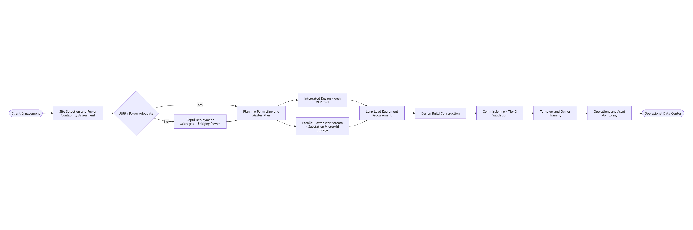
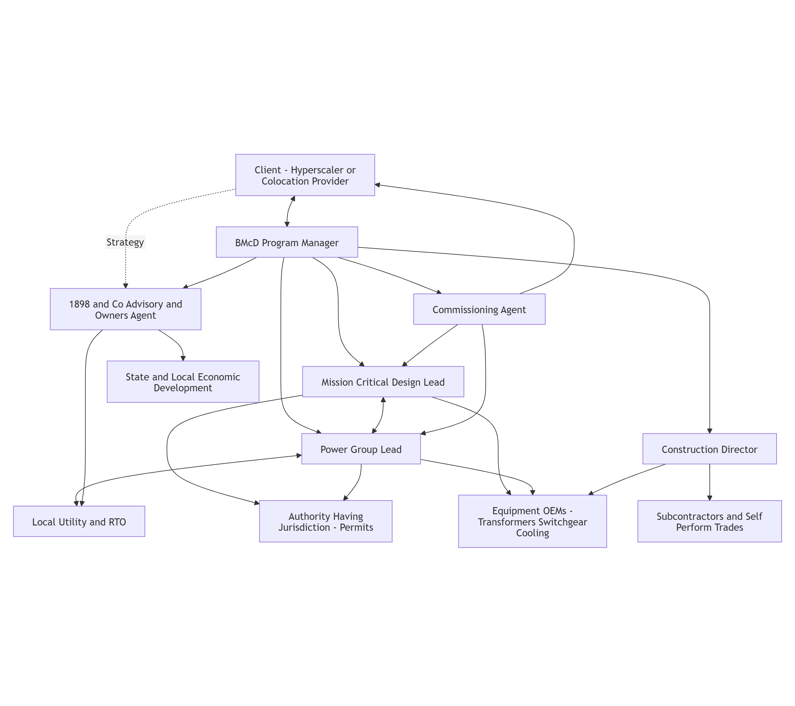
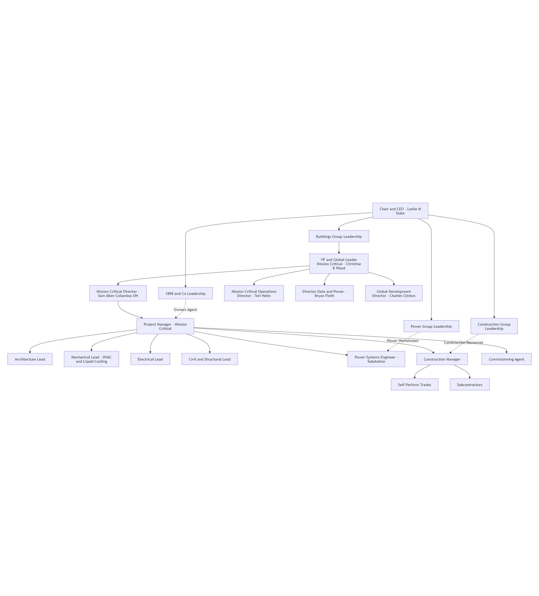

# Integrated Company Model - Burns & McDonnell

## A. Company Snapshot

* **Company Name:** Burns & McDonnell — Mission-Critical Buildings / Data Centers & Switch Centers practice \[1] *(Observed)*
* **Size Tier:** Global; \~$7.2B firm (2026 Global Profile) with 13,000+ employee-owners across the parent enterprise; the Mission Critical practice is one of the firm's fastest-growing global sectors \[2]\[3] *(Observed)*
* **Geographic Footprint:** 75+ offices worldwide, including 50+ U.S. offices and international hubs in Canada, Mexico City, London, Mumbai, and Dubai; data center work is supported globally across multiple offices (e.g., Kansas City, Dallas, San Francisco, Columbus OH, New York, London, Mumbai, Mexico City) \[2]\[4]\[5] *(Observed)*
* **Primary Service Domains:**
  * Electrical Engineering & Power Systems \[1] *(Observed)*
  * Mechanical Engineering — HVAC & Advanced Liquid Cooling \[1]\[6] *(Observed)*
  * Civil / Structural Engineering \[1] *(Observed)*
  * Architecture & Master Planning \[1] *(Observed)*
  * Site Selection & Power Availability Advisory \[1]\[7] *(Observed)*
  * EPC Construction & Design-Build \[1]\[8] *(Observed)*
  * Commissioning & TIA-942 Tier III Validation \[1] *(Observed)*
  * Operations & Maintenance / Long-Term Asset Monitoring \[1] *(Observed)*
* **Primary Client Types:**
  * Hyperscalers (e.g., Meta — Kansas City campus) \[9]\[10] *(Observed)*
  * Colocation & sustainable infrastructure providers (e.g., Edged / Endeavour) \[11] *(Observed)*
  * Commercial enterprises and confidential cloud operators \[1] *(Observed)*
  * Government, federal agencies, and U.S. Department of Defense \[1] *(Observed)*
* **Role in Data Center Ecosystem:** Integrated, employee-owned design-build / EPC firm that combines planners, architects, engineers, and construction professionals "under one roof" to deliver mission-critical facilities and the upstream power infrastructure that feeds them; ranked **#1 U.S. Data Center Engineering Firm (BD+C Giants 400 2025)** and **#2 in Data Centers (ENR 2025)** \[4]\[12] *(Observed)*
* **Delivery Orientation:** Turnkey design-build / EPC with fast-track, integrated lifecycle delivery — from site selection and permitting through procurement, construction, commissioning, and ongoing asset monitoring \[1]\[5] *(Observed)*

***

## B. Organizational Model

The Mission Critical / Data Centers practice sits inside Burns & McDonnell's **Buildings** group and pulls multidisciplinary resources from the firm's **Power**, **Construction**, **1898 & Co. consulting**, and **Environmental** practices into a single integrated delivery team. The model is built around the firm's "all in-house" philosophy: planners, architects, engineers, construction professionals, and commissioning agents co-located on the same project team to compress schedule and eliminate handoffs \[1]\[5] *(Observed)*.

This structure illustrates how the Data Centers & Switch Centers practice acts as the integrator, sourcing power engineering depth from the Power Group (Burns & McDonnell is **#1 in ENR Power Design Firms 2026** and **#1 in Transmission & Distribution 2025**) and advisory from 1898 & Co., enabling fully integrated EPC delivery across the data-center lifecycle \[12]\[13] *(Observed)*. Diagram confidence: *(Inferred)*

***

## C. Functional Decomposition

### Electrical Engineering & Power Systems

* **Purpose:** Engineer fault-tolerant power delivery from the utility interconnect through medium- and low-voltage distribution to the white-space critical load, addressing the 60–100+ MW (and now gigawatt-class) demand of AI-scale facilities \[6] *(Observed)*
* **Key Activities:**
  * One-line, load-flow, short-circuit and arc-flash studies *(Inferred)*
  * Phased EPC substation delivery aligned with load ramping \[1] *(Observed)*
  * Utility interconnection coordination with RTOs \[6] *(Observed)*
  * Long-lead equipment procurement (transformers, switchgear, gen-sets) \[1] *(Observed)*
  * Rapid-deployment microgrid and bridging-power design \[6] *(Observed)*
* **Inputs:** Client load forecasts and ramp schedules, utility tariffs and interconnect studies, site power availability data, equipment lead-time data \[6] *(Observed)*
* **Outputs:** Substation designs, switchgear and UPS specifications, gen-set and microgrid packages, energized power systems delivered on a load-ramp aligned schedule \[1]\[6] *(Observed)*
* **Roles:** Power Systems Engineer, Substation Lead, Utility Interconnection Manager, On-Site Energy Director (e.g., Tom Parker) \[6] *(Observed)*
* **Interfaces:** Local utility / RTO, equipment OEMs, AHJ (permits), Mission Critical design team, Construction Group \[6] *(Observed)*

### Mechanical Engineering — HVAC & Liquid Cooling

* **Purpose:** Design thermal-management systems that handle high-density AI heat loads while improving PUE/WUE and reducing water consumption \[1]\[14] *(Observed)*
* **Key Activities:**
  * Cooling load modeling for high-density racks *(Inferred)*
  * Liquid-cooling (direct-to-chip / immersion) system design \[1]\[14] *(Observed)*
  * Waterless and compressor-less cooling adaptation for arid sites \[14] *(Observed)*
  * PUE / WUE optimization analyses \[14] *(Observed)*
  * Coordination with prototype data-center mechanical "ecosystems" for tier-1 tech clients \[14] *(Observed)*
* **Inputs:** Rack density and heat-load projections, climate / water-availability data, client prototype standards \[14] *(Observed)*
* **Outputs:** Mechanical drawings, equipment specifications, energy and water models, validated cooling topologies \[1]\[14] *(Observed)*
* **Roles:** Mechanical Design Lead (e.g., Sam Allen, Mission Critical Director, Columbus OH — mechanical design responsibility for all Mission Critical teams) \[14] *(Observed)*
* **Interfaces:** Architecture, Electrical Engineering, Commissioning, cooling-equipment OEMs, sustainability consultants \[1]\[14] *(Observed)*

### Civil / Structural Engineering

* **Purpose:** Deliver site civil, foundations, and structural shell engineering to support multi-story data hall buildings, equipment yards, and substations \[1] *(Observed)*
* **Key Activities:**
  * Site grading, stormwater, and utility civil design *(Inferred)*
  * Structural design for multi-story data halls and equipment platforms *(Inferred)*
  * Substation civil/structural design integrated with the power workstream \[1] *(Observed)*
* **Inputs:** Geotech and survey data, site civil drawings, equipment weight/vibration data *(Inferred)*
* **Outputs:** Civil site plans, foundation drawings, structural framing packages *(Inferred)*
* **Roles:** Civil/Structural Lead Engineer *(Inferred)*
* **Interfaces:** Architecture, Mechanical/Electrical disciplines, Construction Group, AHJ for permitting *(Inferred)*

### Architecture & Master Planning

* **Purpose:** Provide programming, space planning, and architectural design for data halls, command suites, control rooms, operations centers, SCIFs, and administrative facilities \[1] *(Observed)*
* **Key Activities:**
  * Site/campus master planning for multi-building hyperscale campuses \[1]\[10] *(Observed)*
  * Architectural design of data halls and security/SCIF facilities \[1] *(Observed)*
  * Prototype data-center design contributions for tier-1 tech clients \[14] *(Observed)*
* **Inputs:** Client design standards, programming requirements, security classification needs, site constraints \[1] *(Observed)*
* **Outputs:** Programming reports, campus master plans, architectural drawings, specification packages \[1] *(Observed)*
* **Roles:** Staff Architect — Mission Critical, Senior Architect — Mission Critical, Principal Architect \[4] *(Observed)*
* **Interfaces:** MEP disciplines, civil/structural, end-client security teams, AHJ, construction *(Inferred)*

### Site Selection & Power Availability Advisory

* **Purpose:** De-risk projects up-front by selecting sites where utility power, water, fiber, and permitting can support the load ramp on schedule \[1]\[6]\[7] *(Observed)*
* **Key Activities:**
  * Site short-listing screened by RTO interconnection-queue dynamics \[6] *(Observed)*
  * Utility tariff and regulatory assessment \[7] *(Observed)*
  * Energy-provider evaluation and selection \[7] *(Observed)*
  * Owner's-agent / 1898 & Co. advisory services \[15] *(Observed)*
  * Northern Virginia, Dallas, Phoenix, Columbus power-capacity strategy work \[6] *(Observed)*
* **Inputs:** Client load and growth forecasts, utility queue data, latency requirements, water availability, tax/incentive overlays \[6]\[7] *(Observed)*
* **Outputs:** Ranked site short-lists, interconnection feasibility memos, regulatory and tariff assessments, business-case decks \[7]\[15] *(Observed)*
* **Roles:** Global Development Director, 1898 & Co. technical directors, Owner's Agent leads \[4]\[15] *(Observed)*
* **Interfaces:** Client real-estate and energy-strategy teams, utilities, RTOs, state/local economic development authorities \[6]\[7] *(Observed)*

### EPC Construction & Design-Build

* **Purpose:** Deliver integrated Engineer-Procure-Construct execution under turnkey design-build contracting, overlapping design and procurement to fast-track speed-to-market \[1]\[5] *(Observed)*
* **Key Activities:**
  * Progressive design-build contracting and target-pricing/open-book commercial models *(Inferred)*
  * Long-lead procurement of transformers, switchgear, gen-sets, and cooling equipment \[1] *(Observed)*
  * Self-perform construction by the Burns & McDonnell Construction Group *(Inferred)*
  * Field execution on multi-building campuses (e.g., Meta Kansas City $1B+ AI-optimized campus) \[9]\[10] *(Observed)*
* **Inputs:** Approved design packages, procurement plans, permit conditions, subcontractor bid packages \[1] *(Observed)*
* **Outputs:** Erected and energized facilities, turnover packages, as-built drawings \[1] *(Observed)*
* **Roles:** Program Manager, Construction Director, Site Superintendent, Project Controls / Scheduling Lead *(Inferred)*
* **Interfaces:** Client construction reps, subcontractors and self-perform trades, equipment OEMs, AHJ inspections, commissioning agent \[1] *(Observed)*

### Commissioning & TIA-942 Tier III Validation

* **Purpose:** Validate that as-built systems achieve no-single-point-of-failure, fault- and maintenance-tolerant performance to **TIA-942 Tier III** standards before turnover \[1] *(Observed)*
* **Key Activities:**
  * Levels 1–5 commissioning of mechanical, electrical, controls, and integrated-systems testing *(Inferred)*
  * Verification of redundancy, failover, and concurrent maintainability per Tier III \[1] *(Observed)*
  * Witness testing of substation, UPS, gen-set, BMS, and cooling systems *(Inferred)*
* **Inputs:** Design intent documents, equipment factory acceptance tests, vendor commissioning data \[1] *(Observed)*
* **Outputs:** Commissioning reports, issues logs, Tier III certification dossiers, owner training materials \[1] *(Observed)*
* **Roles:** Commissioning Agent (in-house), Commissioning Manager *(Inferred)*
* **Interfaces:** Client operations team, design disciplines, OEMs, third-party certification bodies *(Inferred)*

### Operations & Maintenance / Long-Term Asset Monitoring

* **Purpose:** Provide long-term asset monitoring, maintenance, and optimization services after turnover to preserve uptime and efficiency through the facility lifecycle \[1]\[2] *(Observed)*
* **Key Activities:**
  * Ongoing asset monitoring and condition assessment \[1] *(Observed)*
  * Energy and reliability optimization studies *(Inferred)*
  * Battery storage operations support for facilities using BESS (Burns & McDonnell has delivered 6.5+ GWh of BESS to date) \[11] *(Observed)*
* **Inputs:** Sensor / BMS telemetry, performance benchmarks, client SLAs *(Inferred)*
* **Outputs:** Maintenance plans, condition reports, performance dashboards *(Inferred)*
* **Roles:** Mission Critical Operations Director (e.g., Tori Helm), O\&M technicians, reliability engineers \[4] *(Observed)*
* **Interfaces:** Client facility-operations team, OEM service contracts, utility, software vendors *(Inferred)*

***

## D. Workflows

Burns & McDonnell's mission-critical workflow is defined by **power-first site selection, parallel power and facility tracks, fast-track design-build, and in-house commissioning** \[1]\[5]\[6] *(Observed)*. The firm engages early on site feasibility, runs the substation / utility-interconnection workstream in parallel with the data-hall design, and uses rapid-deployment microgrids as a bridge when utility power lags the load ramp \[6] *(Observed)*.

**High-level steps:**

1. **Client engagement & business-case framing** — Owner's agent / 1898 & Co. advisory, load forecasting, market and tariff assessment \[7]\[15] *(Observed)*
2. **Site selection & power availability assessment** — Screen sites by utility queue, RTO dynamics, fiber, water, and incentives \[6] *(Observed)*
3. **Bridging-power decision** — Where utility timing is inadequate, deploy a rapid-deployment microgrid as interim or permanent on-site generation \[6] *(Observed)*
4. **Planning, permitting, and master planning** — Campus master plan, environmental, AHJ permitting \[1] *(Observed)*
5. **Integrated design (Architecture + MEP + Civil/Structural)** — Tier III design with no single point of failure, liquid-cooling-ready halls \[1] *(Observed)*
6. **Parallel power workstream** — Phased EPC substations, microgrids, energy storage aligned to the facility load ramp \[1] *(Observed)*
7. **Long-lead procurement** — Transformers, switchgear, gen-sets, cooling equipment ordered early to compress schedule \[1] *(Observed)*
8. **Design-build construction** — Self-perform plus subcontractor execution under turnkey contracting \[1]\[5] *(Observed)*
9. **Commissioning (Levels 1–5) & TIA-942 Tier III validation** — In-house commissioning agents verify redundancy and maintainability \[1] *(Observed)*
10. **Turnover, owner training, and asset monitoring** — Long-term O\&M and optimization services \[1] *(Observed)*

***

## E. Interaction Model

The interaction model below shows how the **client** interacts with a Burns & McDonnell Program Manager who orchestrates the firm's internal disciplines and the external ecosystem of utilities, RTOs, OEMs, permitting authorities, and subcontractors \[1]\[6] *(Observed)*. The arrows emphasize that the **power workstream** runs as a peer to the **facility design workstream**, which is a defining characteristic of Burns & McDonnell's mission-critical delivery.

The model captures the bidirectional client-PM relationship, the tight DesignLead-PowerLead coupling that lets the substation and facility schedules be aligned, and the dual role of 1898 & Co. in both client strategy work and engagement with utilities and economic-development bodies \[6]\[7]\[15] *(Observed)*. Diagram confidence: *(Inferred)*

***

## F. Example Organizational Chart

This chart reflects the publicly named Mission Critical leadership team (Christine Wood as Global Leader; Sam Allen, Tori Helm, Bryan Floth, and Charles Clinton as directors) reporting through the Buildings Group up to Chair/CEO Leslie Duke, with project-level integration of architects, MEP/civil engineers, construction, and commissioning under a single Mission Critical Project Manager \[4]\[16] *(Observed)*. Diagram confidence: *(Inferred)*

***

## G. References

\[1] <https://www.burnsmcd.com/services/buildings/mission-critical-buildings/data-centers-switch-centers>
\[2] <a href="https://info.burnsmcd.com/hubfs/Collateral/Global%20Profile/Global-Profile-burns-mcdonnell-06487.pdf" target="_blank" rel="noopener noreferrer"><https://info.burnsmcd.com/hubfs/Collateral/Global%20Profile/Global-Profile-burns-mcdonnell-06487.pdf></a>
\[3] <a href="https://www.ceraweek.com/agenda/speakers/leslie-m-duke.html" target="_blank" rel="noopener noreferrer"><https://www.ceraweek.com/agenda/speakers/leslie-m-duke.html></a>
\[4] <a href="https://info.burnsmcd.com/data-centers" target="_blank" rel="noopener noreferrer"><https://info.burnsmcd.com/data-centers></a>
\[5] <a href="https://www.burnsmcd.com/services/buildings/mission-critical-buildings" target="_blank" rel="noopener noreferrer"><https://www.burnsmcd.com/services/buildings/mission-critical-buildings></a>
\[6] <a href="https://info.burnsmcd.com/benchmark/article/hyperscale-data-centers-and-how-to-power-them" target="_blank" rel="noopener noreferrer"><https://info.burnsmcd.com/benchmark/article/hyperscale-data-centers-and-how-to-power-them></a>
\[7] <a href="https://www.burns-group.com/industries/data-centers/" target="_blank" rel="noopener noreferrer"><https://www.burns-group.com/industries/data-centers/></a>
\[8] <a href="https://edged.us/news/edged-brings-ultra-efficient-ai-ready-data-center-with-advanced-waterless-cooling-to-des-moines-iowa" target="_blank" rel="noopener noreferrer"><https://edged.us/news/edged-brings-ultra-efficient-ai-ready-data-center-with-advanced-waterless-cooling-to-des-moines-iowa></a>
\[9] <a href="https://about.fb.com/news/2025/08/metas-kansas-city-data-center-and-upcoming-ai-optimized-data-centers/" target="_blank" rel="noopener noreferrer"><https://about.fb.com/news/2025/08/metas-kansas-city-data-center-and-upcoming-ai-optimized-data-centers/></a>
\[10] <a href="https://startlandnews.com/2025/08/meta-data-center-kansas-city/" target="_blank" rel="noopener noreferrer"><https://startlandnews.com/2025/08/meta-data-center-kansas-city/></a>
\[11] <a href="https://www.energy-storage.news/year-in-review-epc-burns-mcdonnell-on-data-centre-demand-feoc-and-energy-density/" target="_blank" rel="noopener noreferrer"><https://www.energy-storage.news/year-in-review-epc-burns-mcdonnell-on-data-centre-demand-feoc-and-energy-density/></a>
\[12] <a href="https://www.burnsmcd.com/about/industry-rankings" target="_blank" rel="noopener noreferrer"><https://www.burnsmcd.com/about/industry-rankings></a>
\[13] <a href="https://www.bdcnetwork.com/top-80-data-center-engineering-firms-2025-giants-400" target="_blank" rel="noopener noreferrer"><https://www.bdcnetwork.com/top-80-data-center-engineering-firms-2025-giants-400></a>
\[14] <a href="https://www.linkedin.com/pulse/meet-burns-mcdonnell-mission-critical-leadership-team-robert-bonar-urmre" target="_blank" rel="noopener noreferrer"><https://www.linkedin.com/pulse/meet-burns-mcdonnell-mission-critical-leadership-team-robert-bonar-urmre></a>
\[15] <a href="https://1898andco.burnsmcd.com/" target="_blank" rel="noopener noreferrer"><https://1898andco.burnsmcd.com/></a>
\[16] <a href="https://www.burnsmcd.com/about/leadership/leslie-duke" target="_blank" rel="noopener noreferrer"><https://www.burnsmcd.com/about/leadership/leslie-duke></a>

***

## H. Variability and Assumptions

* ***(Observed)*** — The listed item was identified through source material. Observed items include an inline numbered reference where possible.
* ***(Inferred)*** — The listed item was derived from supporting evidence and context, not stated directly in source material.
* ***(Uncertain)*** — The listed item is logical to the identified topic, but clear evidence is unavailable; treat as a hypothesis.

