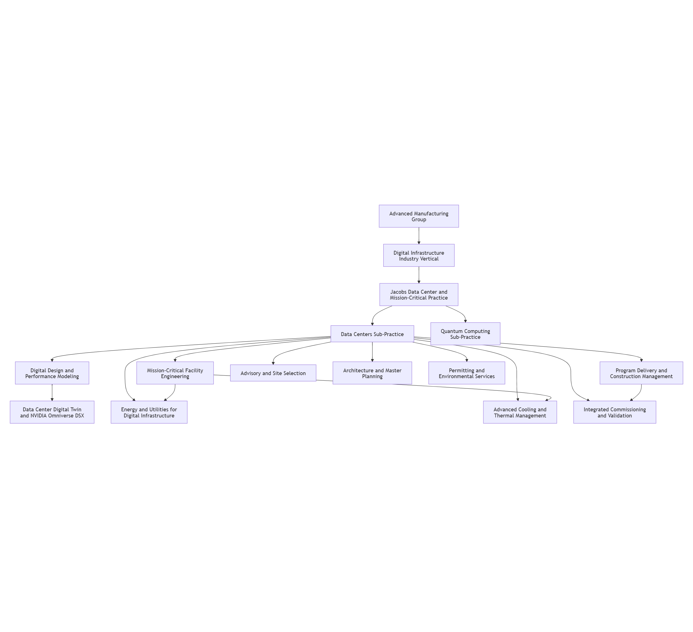
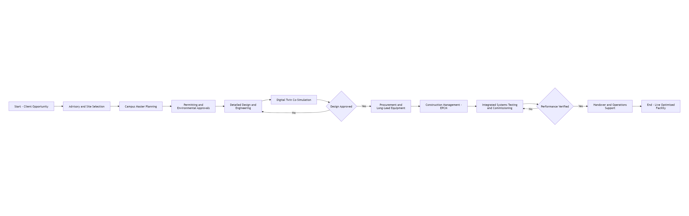
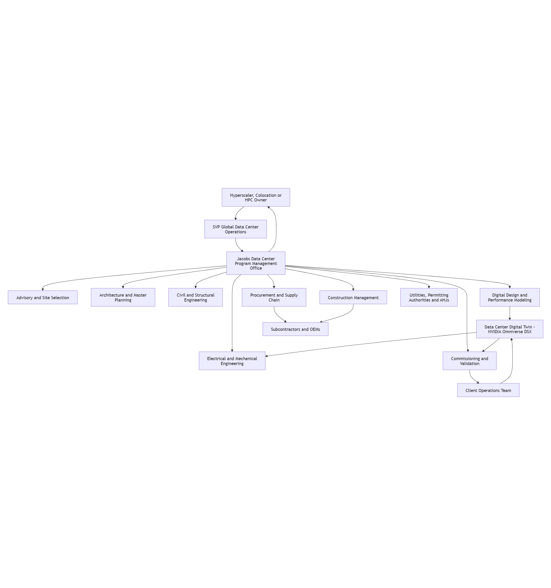
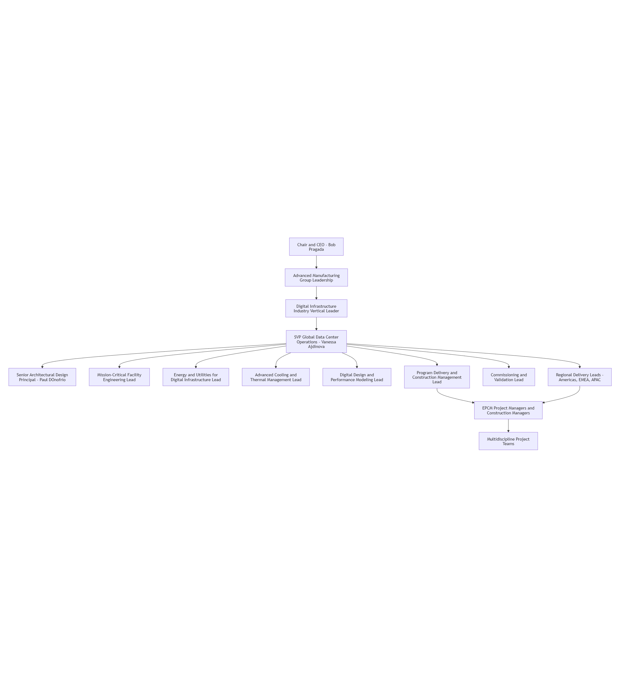

# Integrated Company Model - Jacobs

## A. Company Snapshot

* **Company Name:** Jacobs \[1] *(Observed)*
* **Size Tier:** Global \[1] *(Observed)*
* **Geographic Footprint:** Global (40+ countries) \[1] *(Observed)*
* **Primary Service Domains:**
  * Electrical Engineering \[1] *(Observed)*
  * Mechanical Engineering \[1] *(Observed)*
  * Civil / Structural Engineering \[1] *(Observed)*
  * Architecture & Master Planning \[1] *(Observed)*
  * Commissioning / Validation \[1] *(Observed)*
  * Program & Project Management (EPCM) \[2] *(Observed)*
  * Advisory / Site Selection \[1] *(Observed)*
* **Primary Client Types:** Hyperscalers, colocation providers, AI/HPC operators \[1]\[2] *(Observed)*
* **Role in Data Center Ecosystem:** Multidiscipline design firm + EPCM integrator \[2]\[3] *(Observed)*
* **Delivery Orientation:** End-to-end lifecycle \[1]\[3] *(Observed)*

## B. Organizational Model (Normalized)

The Data Center and Mission-Critical practice sits inside Jacobs' Advanced Manufacturing group and is delivered through the Digital Infrastructure industry vertical, which also houses a Quantum Computing sub-practice \[3]\[4] *(Observed)*. The Data Centers sub-practice combines named solution lines (Digital Design and Performance Modeling, Mission-Critical Facility Engineering, Energy and Utilities, Advanced Cooling and Thermal Management, and Program Delivery and Construction Management) with cross-cutting Advisory, Master Planning, Permitting, and Integrated Commissioning capabilities \[1]\[3] *(Observed)*.

### Functional Structure

**Notes**

* All boxes = **standard framework functions** *(Inferred)*
* Jacobs differentiation appears in **scale, maturity, and digital depth** (5,000+ MW delivered or in design, 30+ years of mission-critical delivery, and a productized NVIDIA Omniverse DSX–based Data Center Digital Twin) — not structure \[1]\[6]\[7] *(Observed)*
* Matrix model: **industry-vertical leadership x solution-practice leaders x regional delivery teams**, with a corporate digital core that owns simulation tooling *(Inferred)*

Diagram confidence: *(Inferred)*

## C. Functional Decomposition (Condensed)

### Electrical Engineering

* **Purpose:** Design resilient, scalable power systems sized for AI and hyperscale rack density \[1] *(Observed)*
* **Key Activities:** Grid interconnection studies, substation engineering, on-site generation, microgrids, energy storage \[1] *(Observed)*; load studies, single-line diagrams, switchgear / UPS specification *(Inferred)*
* **Inputs:** Site assessments, IT load profile, redundancy targets (N+1 / 2N), utility availability, hyperscaler reference designs *(Inferred)*
* **Outputs:** One-line diagrams, equipment specifications, power-system models, integrated energy strategy package \[1] *(Observed)*
* **Roles:** Power systems engineers, Energy and Utilities for Digital Infrastructure lead, Mission-Critical Facility Engineering lead \[3] *(Observed)*
* **Interfaces:** Owner power-procurement team, local utilities and ISOs, OEM switchgear / UPS suppliers, mechanical and cooling discipline, commissioning team \[3] *(Observed)*

### Mechanical Engineering

* **Purpose:** Engineer high-density cooling and thermal systems for GPU-based AI workloads \[1]\[3] *(Observed)*
* **Key Activities:** Direct-to-chip liquid cooling, immersion cooling, advanced thermal management, CFD modeling, water sourcing and reuse \[1]\[3] *(Observed)*
* **Inputs:** Rack-density and GPU heat loads, cooling water availability, climate and sustainability targets *(Inferred)*
* **Outputs:** Cooling topology, CFD analysis, equipment schedules, performance-test procedures *(Inferred)*
* **Roles:** Advanced Cooling and Thermal Management lead, mechanical engineers, CFD specialists \[3] *(Observed)*
* **Interfaces:** Electrical / power discipline, IT / compute provider, OEM cooling suppliers, water-strategy lead, commissioning \[3] *(Observed)*

### Civil / Structural Engineering

* **Purpose:** Provide site civil, structural shell, and water / wastewater infrastructure at campus scale \[1] *(Observed)*
* **Key Activities:** Campus civil works, foundations, structural framework for data halls, cooling-water sourcing, reuse and zero-liquid-discharge strategies \[1] *(Observed)*
* **Inputs:** Geotechnical and hydrology data, seismic and wind loading, master plan, water strategy *(Inferred)*
* **Outputs:** Civil grading and utility drawings, structural framework, foundation design, water-reuse approach *(Inferred)*
* **Roles:** Civil and structural engineers, water-resources engineers *(Inferred)*
* **Interfaces:** Architecture and master planning, MEP, permitting and environmental, AHJs and utilities *(Inferred)*

### Architecture & Master Planning

* **Purpose:** Develop modular campus master plans and architectural reference designs that scale globally for hyperscale and AI clients \[1]\[5] *(Observed)*
* **Key Activities:** Site selection due diligence, campus master planning, standardized global reference design libraries, first-of-a-kind high-density facility design \[1]\[5] *(Observed)*
* **Inputs:** Client growth roadmap, hyperscale platform requirements, regulatory and climate context *(Inferred)*
* **Outputs:** Master plans, modular reference design templates, architectural drawings, programmatic studies \[5] *(Observed)*
* **Roles:** Senior Architectural Design Principal (Data Centers), master planners, lead architects \[5] *(Observed)*
* **Interfaces:** Owner real-estate / platform team, civil / structural discipline, MEP, permitting \[5] *(Observed)*

### Commissioning / Validation

* **Purpose:** Verify integrated systems performance via testing and digital-twin–supported commissioning \[1]\[6] *(Observed)*
* **Key Activities:** Integrated systems testing, virtual commissioning with NVIDIA Omniverse DSX–based digital twin, transition to operations, performance verification \[1]\[6]\[7] *(Observed)*
* **Inputs:** Design documentation, vendor data, commissioning scripts, real-time digital twin model \[6] *(Observed)*
* **Outputs:** Test records, performance reports, operations turnover packages, operational readiness sign-off *(Inferred)*
* **Roles:** Commissioning agents, MEP / controls engineers, digital twin operators \[6] *(Observed)*
* **Interfaces:** Construction management, OEMs, owner operations team, digital design team \[6] *(Observed)*

### Program & Project Management (EPCM)

* **Purpose:** Deliver complex mission-critical campuses through integrated EPCM and program management \[2]\[3] *(Observed)*
* **Key Activities:** Engineering coordination, procurement strategy and supply-chain orchestration, construction management, schedule / cost / quality and safety controls, risk management \[2]\[3] *(Observed)*
* **Inputs:** Owner program objectives, schedule, budget, scope, design deliverables \[2] *(Observed)*
* **Outputs:** Project execution plan, procurement strategy, EPCM reports, delivered facility, turnover documentation \[2]\[9] *(Observed)*
* **Roles:** Program directors, EPCM project managers, construction managers, procurement leads \[2]\[3] *(Observed)*
* **Interfaces:** Owner executive sponsor (e.g., Hut 8), design teams, subcontractors and OEMs, utility / AHJ, commissioning \[2]\[9]\[10] *(Observed)*

### Advisory / Site Selection

* **Purpose:** Provide advisory, feasibility, and site-selection consulting for hyperscale and AI campus owners \[1] *(Observed)*
* **Key Activities:** Power grid availability assessment, water / fiber / risk evaluation, regulatory pre-screening, due diligence and master planning \[1] *(Observed)*
* **Inputs:** Client growth plan, target regions, geopolitical and regulatory risk profile, energy strategy \[1] *(Observed)*
* **Outputs:** Site selection report, feasibility studies, recommended location with risk profile, advisory deliverables *(Inferred)*
* **Roles:** Advisory consultants, master planners, environmental specialists *(Inferred)*
* **Interfaces:** Client executive / real-estate team, local economic development agencies, permitting authorities *(Inferred)*

## D. Workflows

**High-level steps:**

1. **Advisory and Site Selection** — power, water, fiber, climate and regulatory evaluation; campus location recommendation \[1] *(Observed)*
2. **Campus Master Planning** — modular master plan with phased growth using standardized reference design libraries \[1]\[5] *(Observed)*
3. **Permitting and Environmental Approvals** — interconnect, water rights, zoning, environmental impact and regulatory clearance \[1] *(Observed)*
4. **Detailed Design and Engineering** — architectural, MEP, civil / structural and controls design with BIM coordination \[1]\[3] *(Observed)*
5. **Digital Twin Co-Simulation** — virtual model of compute, power, cooling, water and network systems using the Jacobs Data Center Digital Twin built on the NVIDIA Omniverse DSX blueprint \[6]\[7] *(Observed)*
6. **Procurement and Long-Lead Equipment** — specification, sourcing and expediting of critical equipment under the EPCM model \[2]\[9] *(Observed)*
7. **Construction Management (EPCM)** — subcontractor management, schedule, cost, quality and safety oversight on multi-billion-dollar campuses \[2]\[9]\[10] *(Observed)*
8. **Integrated Systems Testing and Commissioning** — virtual and field-based performance verification, supported by the digital twin \[1]\[6] *(Observed)*
9. **Handover and Operations Support** — operations turnover, lifecycle facility optimization and performance analytics via the digital twin \[6] *(Observed)*

Diagram confidence: *(Inferred)*

## E. Interaction Model

Engagements are anchored by the SVP of Global Data Center Operations, who hands ownership to a Jacobs Program Management Office (PMO) acting as the single delivery interface to the client \[2]\[4] *(Observed)*. The PMO orchestrates the discipline teams (advisory, architecture, MEP, civil/structural, digital design), the Data Center Digital Twin built on the NVIDIA Omniverse DSX blueprint, and the procurement, construction-management and commissioning functions \[3]\[6]\[7] *(Observed)*. The digital twin acts as a horizontal integration layer that feeds engineering, drives virtual commissioning, and persists into the client's operations team for lifecycle optimization \[6] *(Observed)*.

Diagram confidence: *(Inferred)*

## F. Example Organizational Chart

Bob Pragada (Chair and CEO) heads Jacobs and publicly champions the data center business as a core growth engine \[2]\[8] *(Observed)*. Within Advanced Manufacturing, the Digital Infrastructure industry vertical contains the Data Centers and Quantum Computing sub-practices, with Vanessa Ajdinova as SVP of Global Data Center Operations leading strategy, growth and delivery worldwide \[3]\[4] *(Observed)*. Paul D'Onofrio serves as Senior Architectural Design Principal for Data Centers, owning standardized reference designs for hyperscale clients alongside leads for Mission-Critical Facility Engineering, Energy and Utilities, Advanced Cooling and Thermal Management, Digital Design and Performance Modeling, Program Delivery and Construction Management, and Commissioning and Validation \[3]\[5] *(Observed)*. Regional delivery leads in the Americas, EMEA and APAC operationalize execution through EPCM project managers and multidiscipline teams \[4] *(Observed)*.

Diagram confidence: *(Inferred)*

## G. References

\[1] <https://www.jacobs.com/industries/data-centers>
\[2] <https://www.jacobs.com/newsroom/press-release/jacobs-appointed-engineering-procurement-and-construction-management-lead>
\[3] <https://www.jacobs.com/industries/digital-infrastructure>
\[4] <https://www.jacobs.com/people/vanessa-ajdinova>
\[5] <https://www.jacobs.com/people/paul-donofrio>
\[6] <https://www.prnewswire.com/news-releases/jacobs-releases-digital-twin-solution-for-ai-data-centers-302714924.html>
\[7] <https://www.prnewswire.com/news-releases/jacobs-to-optimize-data-centers-with-nvidia-ai-factory-digital-twin-blueprint-302458115.html>
\[8] <https://invest.jacobs.com/news/investor-news/news-details/2026/Jacobs-reports-strong-fiscal-second-quarter-2026-results/default.aspx>
\[9] <https://www.businesswire.com/news/home/20260512056081/en/Jacobs-awarded-EPCM-contract-to-deliver-second-Hut-8-AI-data-center-in-Texas>
\[10] <https://www.enr.com/articles/63004-jacobs-expands-epcm-role-with-hut-8s-1-gw-texas-ai-campus>
\[11] <https://www.constructiondive.com/news/data-center-investment-cycle-still-in-early-stages-jacobs-ceo/746811/>
\[12] <https://www.bdcnetwork.com/giants-400/news/55246166/top-60-data-center-engineering-firms-for-2024>

## H. Variability and Assumptions

* ***(Observed)*** — The listed item was identified directly in source material. Includes an inline `[N]` citation immediately before the tag, with the matching URL in Section G.
* ***(Inferred)*** — The listed item was derived from supporting evidence or context, not stated directly in source material. No citation required.
* ***(Uncertain)*** — The listed item is logical for the topic but lacks clear evidence; it is flagged as a hypothesis. No citation required.
